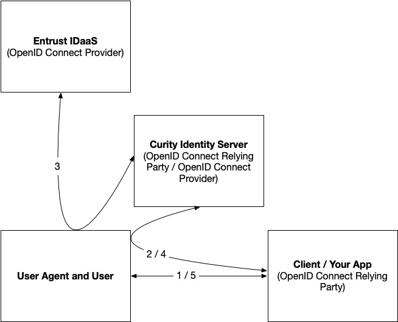
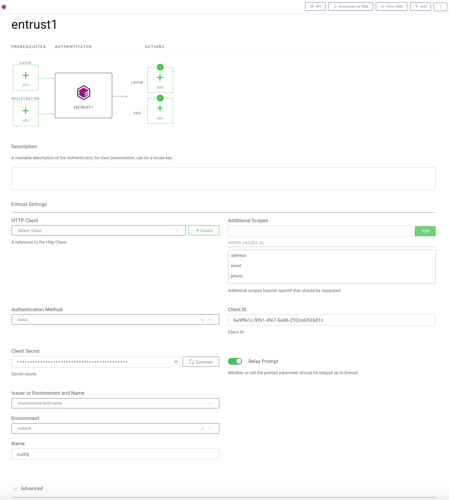

Entrust IDaaS Authenticator Plug-in
===================================

This project provides an open source Entrust IDaaS authenticator plug-in for the Curity Identity Server. This allows an administrator to add functionality to Curity which will then enable end users to login using their Entrust credentials.

Curity can be integrated with Entrust IDaaS in multiple ways. This authenticator is only needed when Curity is functioning as a *relay* or OpenID Connect *proxy* between Entrust IDaaS and a downstream client. This setup is shown in the following figure:

In this figure, the user operating a user agent, like a browser will make a request to a client application. This application (also known as a relying party) is probably made or procured by you and is the one you're using Curity to protect. When the user requests access to this application without a session (step 1 in the figure), they are redirected to Curity (step 2) using OpenID Connect or OAuth. The client is configured to use the Entrust IDaaS authenticator or will manually select it from a list of allowed authenticators. Either way, the user will be redirected to Entrust IDaaS using OpenID Connect (step 3). There, the user will login, and be redirected back to Curity. Curity will complete the OpenID Connect flow by redeeming the authorization code it receives, and calling the user info endpoint of Entrust IDaaS as needed. At this point, the user agent will be redirected back to the application (step 4). Typically, it will create a session for the user at this point and be logged in (step 5).

System Requirements
~~~~~~~~~~~~~~~~~~~

* Curity Identity Server 5.0.0 and `its system requirements <https://developer.curity.io/docs/latest/system-admin-guide/system-requirements.html>`_
* The Entrust logo will only be shown in the Curity admin UI for instances of this authenticator if using version 6.7.3 or newer.

Requirements for Building from Source
"""""""""""""""""""""""""""""""""""""

* Maven 3
* OpenJDK 11

Compiling the Plug-in from Source
~~~~~~~~~~~~~~~~~~~~~~~~~~~~~~~~~

The source is very easy to compile. To do so from a shell, issue this command: ``mvn package``. The resulting JAR file will be located in the ``target`` directory and be named ``entrust-idaas-*.jar``.

Installation
~~~~~~~~~~~~

To install this plug-in, either download a binary version available from the `releases section of this project's GitHub repository <https://github.com/curityio/entrust-idaas-authenticator/releases>`_ or compile it from source (as described above). If you compiled the plug-in from source, the package will be placed in the ``target`` subdirectory. The resulting JAR file or the one downloaded from GitHub needs to placed in the directory ``${IDSVR_HOME}/usr/share/plugins/entrust-idaas`` of each node. (The name of the last directory, ``entrust-idaas``, which is the plug-in group, is arbitrary and can be anything.) After doing so, the plug-in will become available as soon as the node is restarted.

    📝 **Note**
    
    The JAR file needs to be deployed to each run-time node and the admin node. For simple test deployments where the admin node is a run-time node, the JAR file only needs to be copied to one location.

For a more detailed explanation of installing plug-ins, refer to the `Curity developer guide <https://developer.curity.io/docs/latest/developer-guide/plugins/index.html#plugin-installation>`_.

Creating an App in Entrust
~~~~~~~~~~~~~~~~~~~~~~~~~~~~~~~~

As `described in the Entrust IDaaS documentation <https://entrust.us.trustedauth.com/documentation/help/admin/index.htm#t=Shared%2FWelcome.htm&rhsearch=groups%20claim&rhsyns=%20>`_, you can `create a generic OIDC and OAuth Web application <https://entrust.us.trustedauth.com/documentation/help/admin/index.htm#t=Resources%2FAdd_Generic_OIDC_application.htm&rhsearch=groups%20claim&rhsyns=%20>`_ that can be used to authenticate Entrust IDaaS users to your instance of Curty. To do this, follow these steps in the Entrust IDaaS administrative console:

1. From the dashboard, click ``Applications`` or click the menu button and select ``Resources`` and then ``Applications``.

    .. figure:: docs/images/create-entrust-oidc-app.png
        :name: doc-new-entrust-oidc-app
        :align: center
        :width: 500px

2. Click the ``+`` button in the top left corner of the ``Applications List`` page.
3. In the ``OpenID Connect and OAuth Cloud Integrations`` section, select ``Generic Web Application``.
4. On the ``General`` step of the ``Add Generic Web Application`` wizard, enter a name (e.g., ``Curity Identity Server``). Optionally, add a description and upload a logo.
5. On the ``Setup`` step of the wizard, take note of the ``Client ID`` and ``Client Secret``. These will be needed in steps 6 and 7 of the next section, respectively.
6. If you change the ``Token / Revocation Endpoint Client Authentication Method`` from its default to ``Client Secret Post``, you will need to ensure that the Curity authenticator configuration set in step 9 of the next section is also changed accordingly.
7. If you want to pass through from Curity OAuth clients to Entrust IDaaS transparently, uncheck ``Require Consent``.
8. Ensure that ``Authorization Code`` is the *only* grant type selected (which is the default).
9. Ensure that ``Authorization Code PKCE Code Challenge Method`` is set to ``S256`` (the default). No other option is supported.
9. Check the ``Include Authentication Time`` checkbox.
10. Click ``Add`` and enter the redirect URI in the ``Login Redirect URI(s)`` multi-select widget. This can be obtained from the ``Info`` toolbar button of the Entrust IDaaS authenticator after creating it in the next section. It will be of the form ``https://<host>:<port>/<authenticate_endpoint>/<authenticator_id>/callback``.

    .. figure:: docs/images/info-about-redirect.png
        :align: center
        :width: 400px

11. Check any scopes from the ``Supported Scopes`` that should be used. Note that these will have to be added in step 8 of the next section.
12. Select a ``Subject ID Attribute``. It is *recommended* to use ``Unique User ID``.

    **Note**:

    The Entrust IDaaS authenticator will be able to handle any singing settings for ID tokens and user info, so the defaults should be OK.

Creating an Entrust IDaaS Authenticator in Curity
~~~~~~~~~~~~~~~~~~~~~~~~~~~~~~~~~~~~~~~~~~~~~~~~

The easiest way to configure a new Entrust authenticator is using the Curity admin UI. The configuration for this can be downloaded as XML or CLI commands later, so only the steps to do this in the GUI will be described.

1. Go to the ``Authenticators`` page of the authentication profile wherein the authenticator instance should be created.
2. Click the ``New Authenticator`` button.
3. Enter a name (e.g., ``entrust1``). This name needs to match the URI component in the callback URI set in the Entrust app.
4. For the type, pick the ``Entrust`` option and click ``Next``.
5. On the next page, you can define all of the standard authenticator configuration options like any previous authenticator that should run, the resulting ACR, transformers that should executed, etc. 

    At the top of the configuration page, the Entrust-IDaaS-specific options can be found.

        📝 **Note**

        The Entrust-IDaaS-specific configuration is generated dynamically based on the `configuration model defined in the Java interface <https://github.com/curityio/entrust-idaas/blob/main/src/main/java/io/curity/entrust/idaas/config/EntrustAuthenticatorPluginConfig.java>`_.

6. In the ``Client ID`` text field, enter the ``Client ID`` from the Entrust IDaaS client application.
7. Also enter the matching ``Client Secret``.
8. If you wish to request additional scopes from Entrust IDaaS, enter each one in the ``Additional Scopes`` multi-select widget (e.g., ``address`` or ``profile``).
9. The ``Authentication Method`` should match the configuration for the client in Entrust IDaaS. The default is ``basic`` authentication.
10. If ``Relay Prompt`` is configured and an OAuth client sends a ``prompt`` to the Curity OAuth server, then this parameter will be forwarded upstream to Entrust IDaaS.
11. In the ``Issuer or Environment and Name`` dropdown select and configure one of the following:

    A. ``environment-and-name`` can be selected and one of the environments where your Entrust IDaaS is hosted should be selected. In this case, the instance name also has to be configured.
    B. ``issuer`` can be selected and the Entrust IDaaS OpenID Connect issuer URL can be configured.

12. To rely only on the SSO session stored in Entrust IDaaS, do the following:

    A. Click ``Advanced`` to expand the advanced settings.
    B. In the ``SSO Expiration Time`` text field, enter ``0``.

12. Once all of these changes are made, they will be staged, but not committed (i.e., not running). To make them active, click the ``Commit`` menu option in the ``Changes`` menu. Optionally, enter a comment in the ``Deploy Changes`` dialogue and click ``OK``.

Once the configuration is committed and running, the authenticator can be used like any other.

    📝 **Note**

    If you need to contact the Entrust IDaaS web services via a proxy, then you should also configure the optional HTTP client. Such an HTTP client can be done by `following the as described in the reference manual <https://curity.io/docs/idsvr/latest/system-admin-guide/http-clients/index.html>`_. Once complete, select this from the ``HTTP Client`` dropdown list.

Passing Along the ACR
"""""""""""""""""""""

To pass the Entrust IDaaS ACR down through Curity to an OAuth client, a token procedure has to be added because authenticators like the Entrust one cannot change the ACR (by design). In cases where the use of the Entrust ACR is desirable, do the following:

1. Go to the ``Endpoints`` page of the token service profile that is associated with the authentication profile wherein the Entrust IDaaS authenticator is configured.
2. Select an endpoint with an ``Endpoint Type`` of ``oauth-token`` to expand the possible flows supported by this endpoint.
3. In the ``Authorization Code`` dropdown, click ``New procedure``. Give it a name (e.g., ``change_acr``) and click ``Save``.
4. In the procedure that opens, modify the condition that checks ID token data. This will be on or around line 21

.. code:: javascript

    if (idTokenData) {
        var idTokenIssuer = context.idTokenIssuer;
        
        // START ADD
        var upstreamAcr = context.contextAttributes().upstream_acr;
        
        if (upstreamAcr) {
            idTokenData.acr = idTokenData.amr = upstreamAcr;
        }
        // END ADD
        
        idTokenData.at_hash = idTokenIssuer.atHash(issuedAccessToken);

        responseData.id_token = idTokenIssuer.issue(idTokenData, issuedDelegation);
    }

Mapping Claims
""""""""""""""

All of the claims issued by Entrust IDaaS are saved in the authentication attributes of the user's session. As a result, these can be used to fulfill claims issued by Curity. For details, refer to the guide on `using authentication attributes as claims <https://curity.io/resources/learn/claims-from-authenticated-subject/>`_. The abbreviated version is to:

1. Ensure that a claims provider of type ``authentication-subject-claims-provider`` is configured.
2. For some claims that the downstream OAuth client will request of Curity, ensure that it gets its source from the authentication attributes. If these do not exactly match the ones asserted by Entrust IDaaS, they'll need to be mapped. When they do though, they can be used without mapping. In the later case, if Entrust IDaaS is configured with an additional scope of ``profile``, then a claim of ``given_name`` will be asserted by it. For this same claim in Curity, use the authentication attributes as its source. Then, for any downstream client that requests the ``profile`` scope from Curity, the value from Entrust IDaaS will be used.

License
~~~~~~~

This plugin and its associated documentation is listed under the `Apache 2 license <LICENSE>`_.

More Information
~~~~~~~~~~~~~~~~

Please visit `curity.io <https://curity.io/>`_ for more information about the Curity Identity Server.

Copyright (C) 2022 Curity AB.
